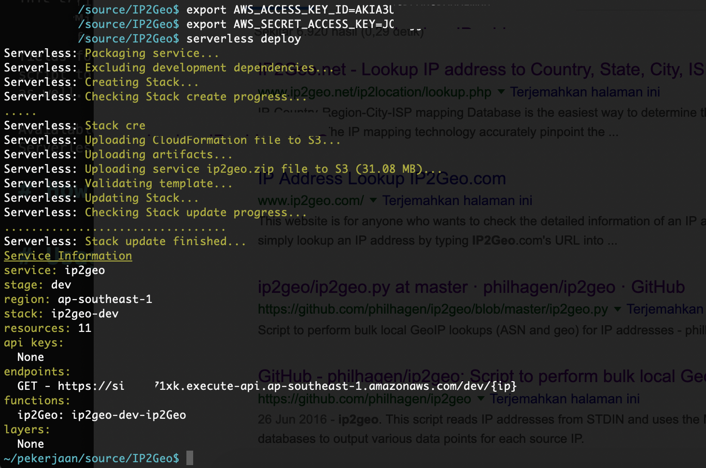
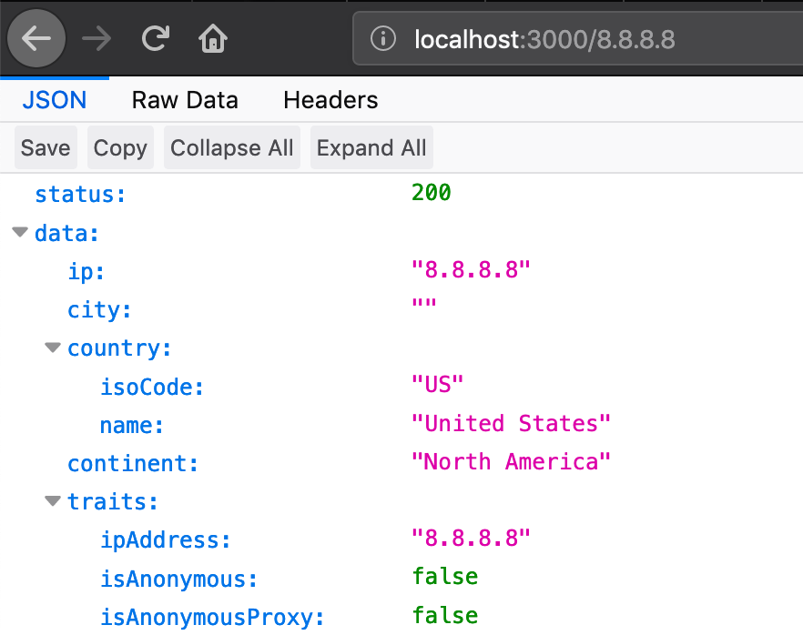

# IP to Geolocation

This script reads IP addresses from parameter and uses the MaxMind GeoIP databases to output various data points for each source IP. The user can specify various fields for output in a format string. You can use this script to download the GeoIP database files if needed as well.

**Avaialable as Single API or build on Amazon Lambda Serverless Infrastructure.**

This script is an example of using [API to Serverless Bridge](https://github.com/luridarmawan/API-to-Serverless-Bridge).


## How to Build

Download MaxMind City GeoLite2 Database (GeoLite2-City.mmdb) from [https://dev.maxmind.com/geoip/geoip2/geolite2/](https://dev.maxmind.com/geoip/geoip2/geolite2/), then copy it in 'data' directory. 

Copy file "config/cp-Config.json" to "config/Config.json"

### Run as single service

```bash
$ yarn
$ node index.js
```

if you use nodemon

```bash
$ yarn
$ nodemon index.js
[nodemon] 1.18.11
[nodemon] to restart at any time, enter `rs`
[nodemon] watching: *.*
[nodemon] starting `node index.js`
Listening on port 3000
```

### Build to AWS Lambda / API Gateway

Make sure read the documentation of [Nodejs Serverless Framework](https://serverless.com/framework/docs/).

One thing we need to make sure before deploying this service is that we create and store the required AWS credentials. Details can be found [here](https://serverless.com/framework/docs/providers/aws/guide/credentials/). You can even use below command to set AWS credentials for serverless:

```
$ serverless config credentials --provider aws --key AWS_ACCESS_KEY --secret AWS_SECRET
```

[see serverless configuration file](serverless.yml)

```bash
$ serverless deploy
```




This command will automatically create the Serverless Lambda Function and API Gateway in the AWS account.


## Usage

You can access it from browser, http://localhost:3000/[the_ip], example: http://localhost:3000/8.8.8.8

OR with Amazon API Gateway url: https://somecode.execute-api.ap-southeast-1.amazonaws.com/dev/8.8.8.8

Manual test from terminal:

```bash
$ curl http://localhost:3000/8.8.8.8
{
  "status": 200,
  "data": {
    "ip": "8.8.8.8",
    "city": "",
    "country": {
      "isoCode": "US",
      "name": "United States"
    },
    "continent": "North America",
    "traits": {
      "ipAddress": "8.8.8.8",
      "isAnonymous": false,
      "isAnonymousProxy": false,
      "isAnonymousVpn": false,
      "isHostingProvider": false,
      "isLegitimateProxy": false,
      "isPublicProxy": false,
      "isSatelliteProvider": false,
      "isTorExitNode": false
    }
  }
}
```

```bash
$ curl https://somecode.execute-api.ap-southeast-1.amazonaws.com/dev/8.8.8.8
{
  "status": 200,
  "data": {
    "ip": "8.8.8.8",
    "city": "",
    "country": {
      "isoCode": "US",
      "name": "United States"
    },
    "continent": "North America",
    "traits": {
      "ipAddress": "8.8.8.8",
      "isAnonymous": false,
      "isAnonymousProxy": false,
      "isAnonymousVpn": false,
      "isHostingProvider": false,
      "isLegitimateProxy": false,
      "isPublicProxy": false,
      "isSatelliteProvider": false,
      "isTorExitNode": false
    }
  }
}
```




## Improvement


## Contributing

We are happy to accept more line code from the community. 🎉

## References

- [API to Serverless Bridge](https://github.com/luridarmawan/API-to-Serverless-Bridge)
- [Amazon AWS Lambda Documentation](https://docs.aws.amazon.com/lambda/index.html)
- [Amazon AWS API Gateway Documentation](https://docs.aws.amazon.com/apigateway/index.html)
- [Nodejs Serverless Framework](https://serverless.com/)


